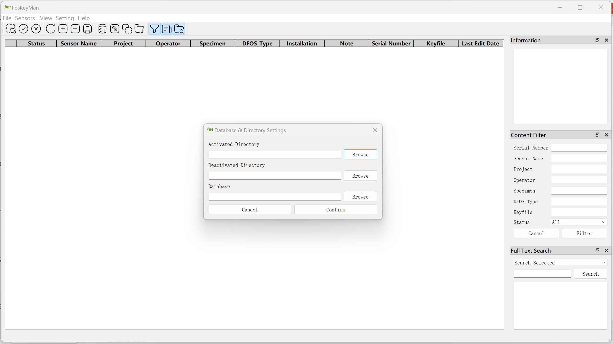
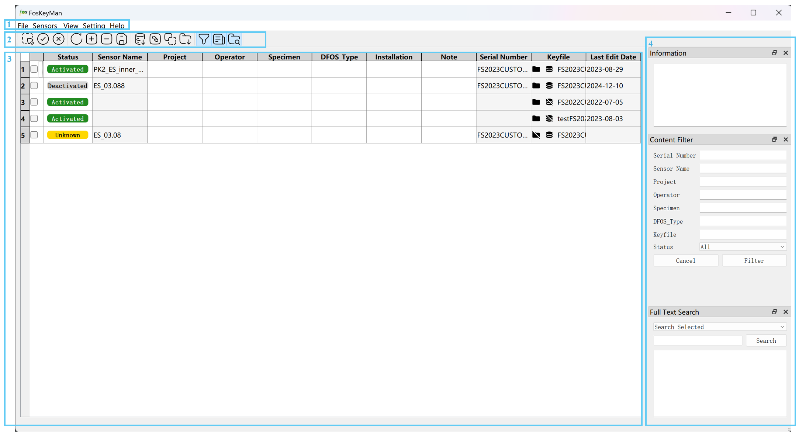
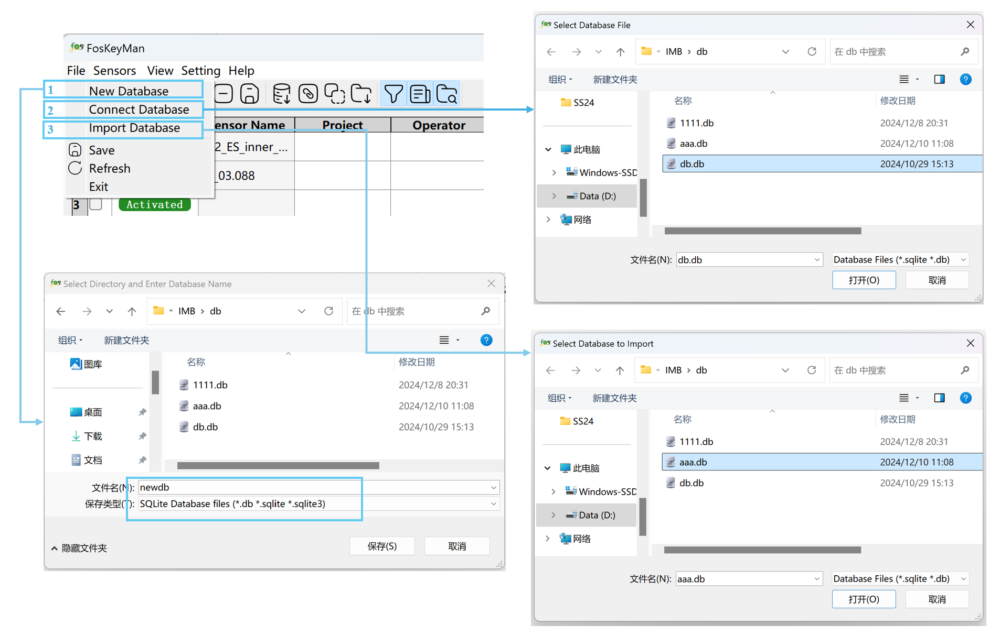
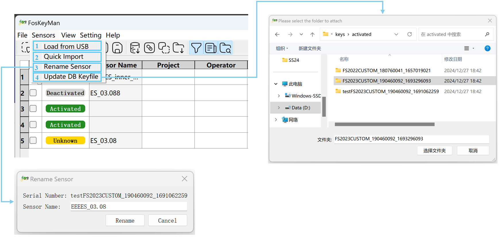
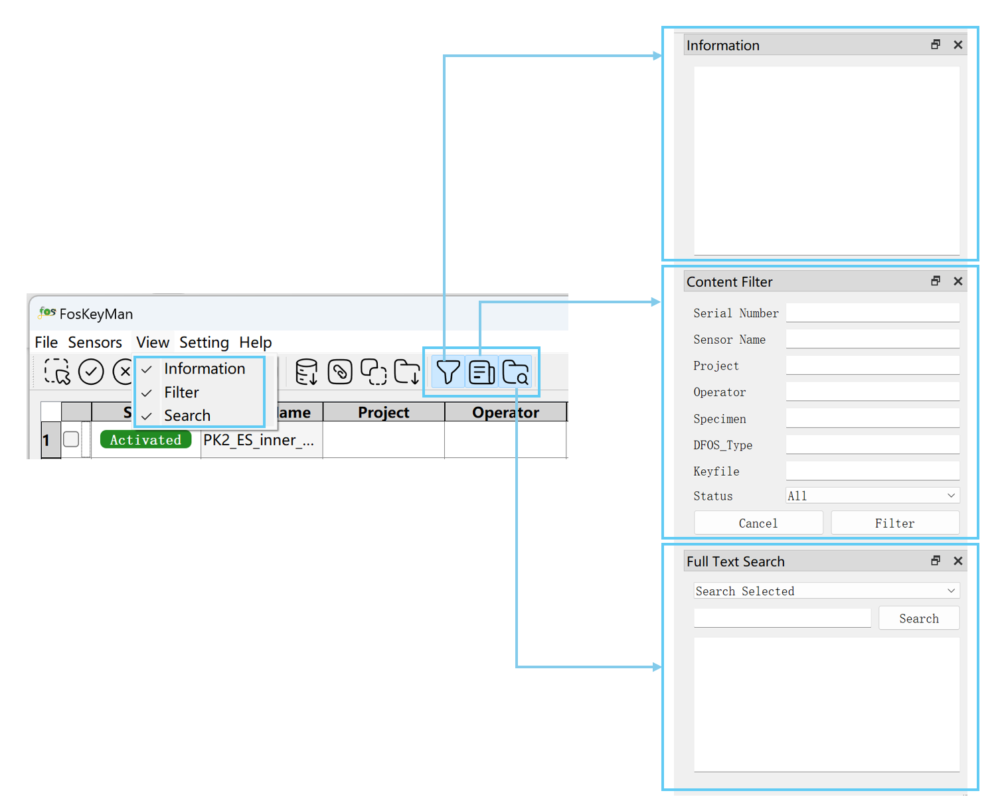
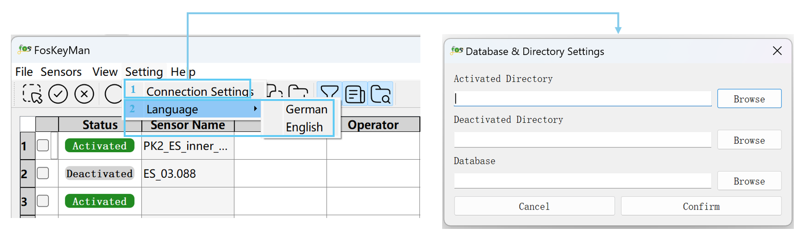
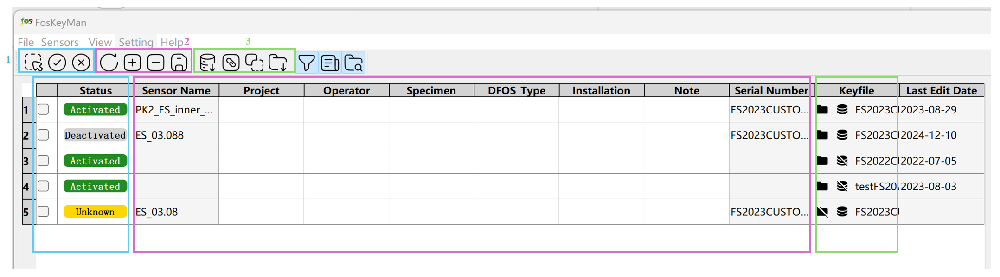
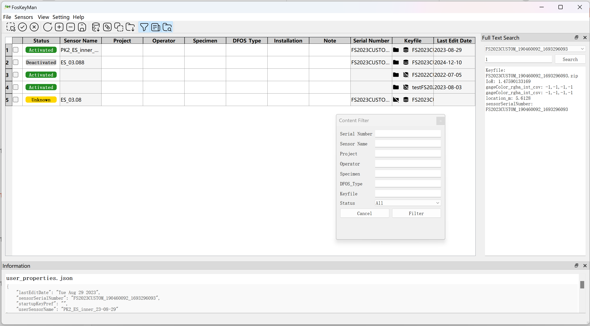

# fosKeyMan – Fiber Optic Sensor Key Manager for Luna ODiSI

[Latest automatically generated documentation](https://fosKeyMan-tud-imb-fos-cffd7ddd34f22a2e0a4090c418b304ff9b0759ab25.gp.hrz.tu-chemnitz.de)

## Motivation
Each distributed fiber optic sensor (DFOS) has a unique backscattering behavior.
Since this behavior is unique, the characteristics are called "fingerprint" of the DFOS.
The interrogator ODiSI 6100 series manufactored by Luna Inc. stores such fingerprints in so called key files.
DFOS connected to the ODiSI are identified by comparing their fingerprint to those stored ODiSI's key collection.
This process takes the more time, the more keys are active.
Hence, it is desirable to have only the keys to the connected DFOS active.
One can activate and deactivate keys in the "Manage Sensor Keys" interface of the ODiSI software,
but the presented list is difficult to navigate and dows not provide meta-data.
Additionally, the there is no search function, so finding the desired keys is tricky and managing sensor keys is tedious.
Hence, working with many DFOS (and thus many keys) gets cumbersome.
fosKeyMan aims to provide a more userfriendly interface for DFOS sensor key management.

## Features

### Main Interface Overview

When you run the software for the first time, a dialog window will automatically pop up, prompting you to configure two
keyfile directories and connect to a database. 
Once these are set up and connected, the software will read keyfiles from both the database and the directories. 
If you don't have a database ready, you can choose to connect later.

After successfully configuring and connecting, the data will be displayed in the table within the software interface, as shown below:

As shown in the image, the program window mainly consists of four parts:
1. **Menubar**: Includes options such as File, View, Setting, and Help.
2. **Toolbar**: Provides operations for table content, database management, keyfile operations, and toggling the side panel.
3. **Table**: Displays keyfiles and metadata sourced from both disk and database.
4. **Tool side panel**: Some side panel for additional tools.

Next, we will introduce the features and usage in each parts in detail.

### Menubar

Menubar includes options such as File, View, Setting, and Help.

1. **File Menu**: The File includes essential operations for managing databases and files within the application. 
It contains standard options like **Save**, **Exit**, and **Refresh**, as well as advanced database management features:

- **Create New Database**: Enter the database name, and a new database with a table will be automatically created in the selected path.
For more information on the table structure, see [Database columns](#database-columns).
- **Connect Database**: Choose an existing database file to connect to it.
- **Import Database**: Import the contents of another database into the current database.
If there are conflicts, a merge window will pop up, allowing the user to resolve the conflicts manually.
- **Fill in missing metadata**: Detect keyfiles present on disk but missing in the database.
A bulk edit window will be displayed, enabling users to batch import the missing metadata.

2. **Sensors Menu**: Provide several operations for managing sensor key files.

- **Load from USB**: Copy key files directly from an external USB device to the local deactivated keyfile directory.
- **Quick Import**: Quickly imports all keyfiles that missing in the database. This operation will create new entries and reads sensor names and serial numbers from the userProperties.json file.
- **Rename Sensor**: Edits the content of the sensor name column.
- **Update DB Keyfile**: Update existing attached file for keyfiles in the database. The new attachment will overwrite the previous one.

3. **View Menu**: Allow you to customize the view, toggling tool panels.

4. **Setting Menu**: Provide options for configuring application settings and language setting.

- **Connection Settings**: Manage keyfile directory settings and select the database.
- **Language**: Switch the software language between German and English for internationalization support.

5. **Help Menu**: Include documentation, and information about the application.

### Toolbar

The toolbar consists of four parts. In addition to the tools mentioned before in the **View Menu** for
quickly toggling the visibility of the side tool window, the remaining three parts serve the following purposes:

1. **Keyfile Activation**: Select or unselect all checkboxes, and control the activation status of keyfiles.
2. **Database Metadata Editing**: Include options to refresh, add, delete, and save changes. This allows synchronized
editing of the metadata content in the database.
3. **Special Operations for Keyfiles**: Provide specific actions for keyfiles based on their status. In order, they are:
   - **Import**: Import keyfiles into the database. This is used for keyfiles that exist on disk but are not yet in the database.
   - **Attach**: Attach a keyfile to the database. This is for cases where the entry exists in the database but the
   corresponding keyfile is missing in the database.
   - **Replace**: Compare and replace the keyfile between the database and the disk when a mismatch is detected.
   - **Copy**: Copy the keyfile to the disk. This is for keyfiles that are only in the database but not on the disk.
   It will copy the keyfile from database to the local activated directory.

For more details on key file state and their operation relationships, see [Key file state](#key-file-state).

## Table

The first column of the table contains checkboxes, which allows you to select each row for subsequent activation actions.
The table contents are derived from metadata stored in the database.
The last column displays keyfile information, with icons shown in front of the keyfile to indicate specific state. 
Three icons are:

- **Folder**: Indicate the keyfile state on the disk. A folder icon with a slash means the keyfile is missing from the disk.
- **Database**: Indicate the keyfile state in the database. A database icon with a slash means the keyfile is missing from the database.
- **Yellow warning symbol**: Indicate a keyfile mismatch between the database and disk.

For more details on key file state, see [Key file state](#key-file-state).

### Side Tool Panel

By default, three tool panels are available on the right side. You can enable or disable them as needed.

1. **Information**: When you click on a cell in the table, this panel displays additional information related to
the keyfile's associated JSON file, providing more detailed content.
2. **Content Filter**: Allows users to filter the content of the table based on different table headers.
Clicking "Cancel" will reset the filter and display all content in the table.
3. **Full Text Search**: Used to perform full-text searches within keyfiles.
You can choose to search within a specific keyfile, or if none is selected, the search will be conducted across all keyfiles in the directory.

These tool panels can be freely dragged and placed at different positions around the program (top, bottom, left, or right).
They can also float independently as separate panels over the main program interface. As shown in the image below:

## Database columns
The database contains one table with the following columns:

| Column Name   | Data Type | Description                                                      |
| :------------ | :-------- | :--------------------------------------------------------------- |
| serial_number | str       | Serial number of the senosr, used as primary key in the database |
| name          | str       | Human readable name of the DFOS                                  |
| project       | str       | Project in which the DFOS is used                                |
| operator      | str       | Person responsible for the DFOS                                  |
| specimen      | str       | Name of the specimen which the DFOS is attached to               |
| dfos_type     | str       | Type of the cable itself (coating material, diameter, etc)       |
| installation  | str       | How the DFOS is installed at/in the specimen                     |
| notes         | str       | Verbose description of the sensor and its use                    |
| status        | str       | State of the sensor (intact, defect, disposed, ...)              |
| keyfile       | binary    | The ODiSI key file as attachment                                 |
| ...           | ...       | Optionally more data (to be continued)                           |

## Key file state
The GUI table shows all availble sensor keys from the union three sources and indicate the state:
1. the data base (including key file)
2. the activated directory, and
3. the deactivated directory.

The activation state be determined from the location of the key file, but not permanently stored in the data base.
The following states are possible:
1. Activated: file is found in the activated directory
	Deactivating should move the file to the deactivated directory.
2. Deactivated: file is found in the deactivated directory
	Activating should move the file to the activated directory.
3. Unknown: The key file is found neither in the activated nor the deactivated directory.
    1. Data base: file is not found in the directories, but in the database.
    	In this case the file should be copied upon its activation from the data base to the activated directory.
    2. Missing: file is neither found in the directories nor in the data base
    	In this case, the key file state should show a warning sign (red triangle with exclamation mark).

The key also have a file state:
1. Key serial number not in data base.
2. Key serial number in data base, but no attached key file.
3. Key serial number in data base and key file attached.

With those states, the following cases are possible:

| Activation  | Serial number in data base | File attached | Activation                       | Optional actions                                            |
| :---------- | :------------------------- | :------------ | :------------------------------- | :---------------------------------------------------------- |
| activated   | no                         | no            | deactivate (move file)           | import (add key serial number and metadata and attach file) |
| deactivated | no                         | no            | activate (move file)             | import (add key serial number and metadata and attach file) |
| activated   | yes                        | no            | deactivate (move file)           | attach file                                                 |
| deactivated | yes                        | no            | activate (move file)             | attach file                                                 |
| activated   | yes                        | yes           | deactivate (move file)           | check file for identity: replace in database or on disk     |
| deactivated | yes                        | yes           | activate (move file)             | check file for identity: replace in database or on disk     |
| unknown     | yes                        | no            | file is missing!                 | warn                                                        |
| unknown     | yes                        | yes           | activate (copy key file to disk) |                                                             |

## Software stack
- Database: SQLite3
- Backend/Logic: Python3
- Frontend: Qt6/PySide6

## Authors
Bertram Richter and Xiaoli Song
