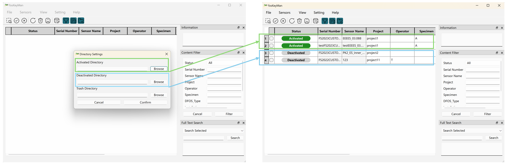
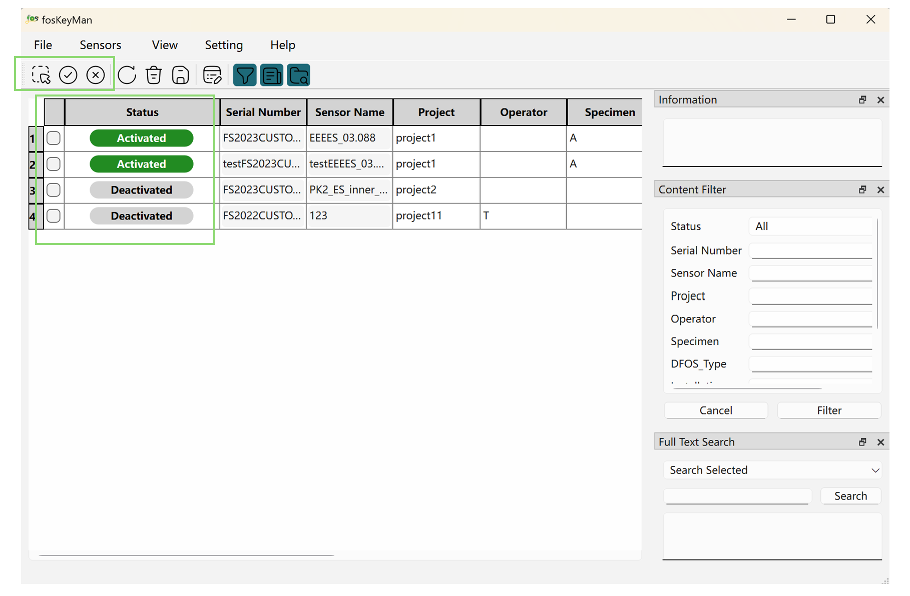
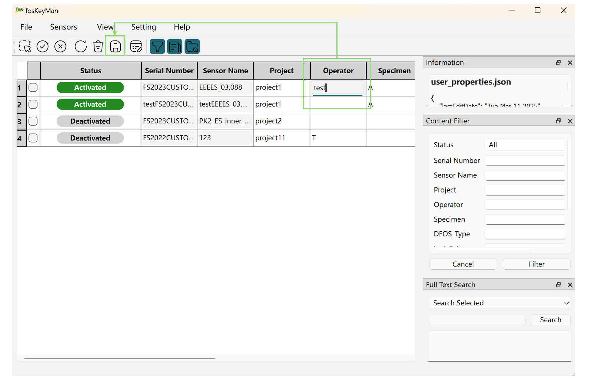
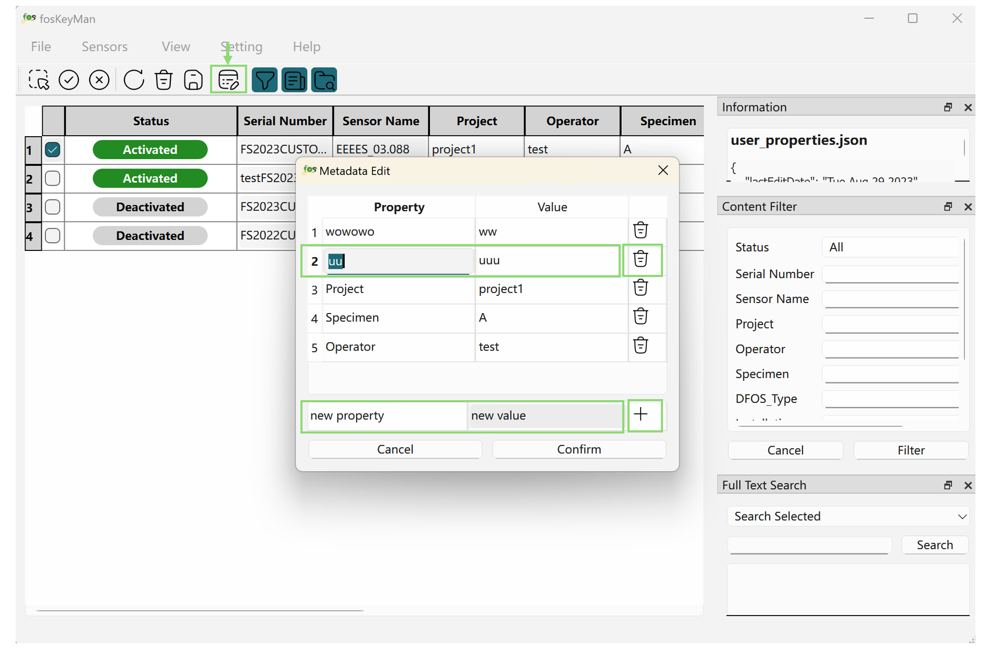
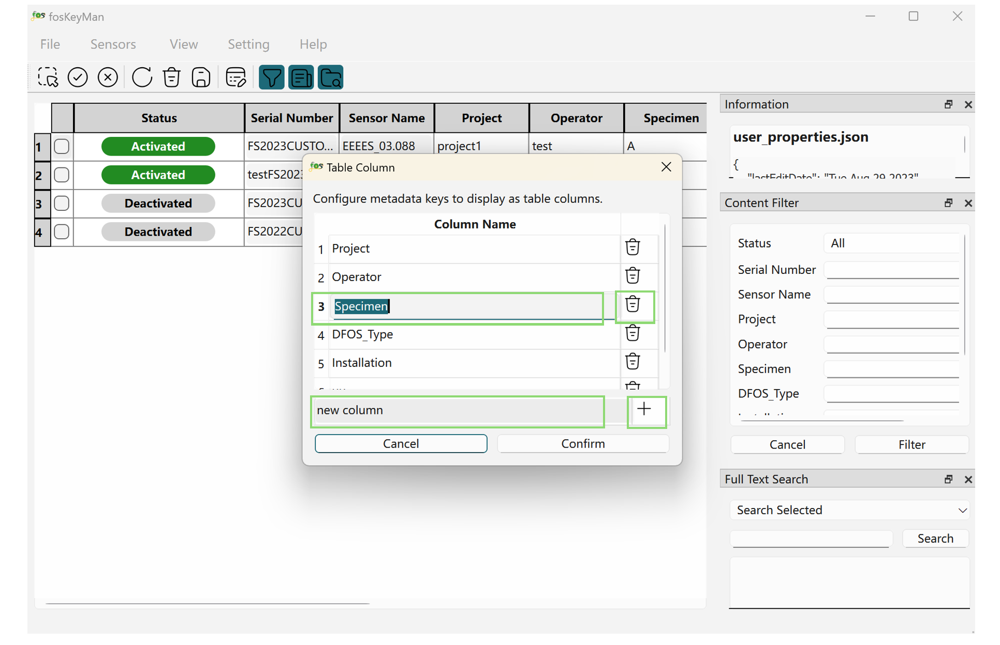
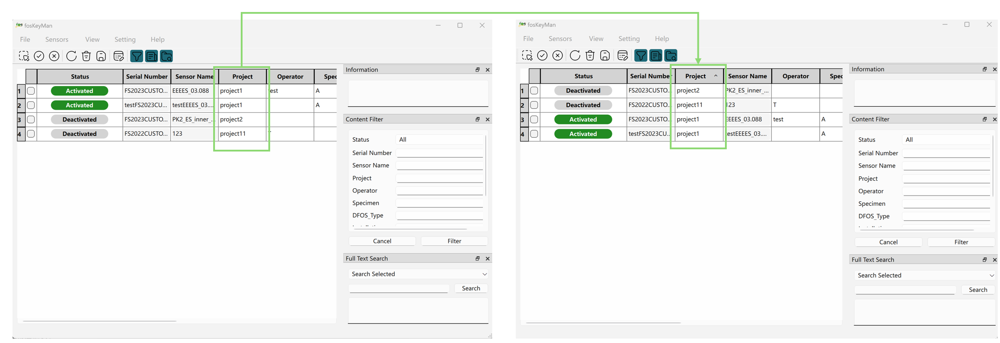
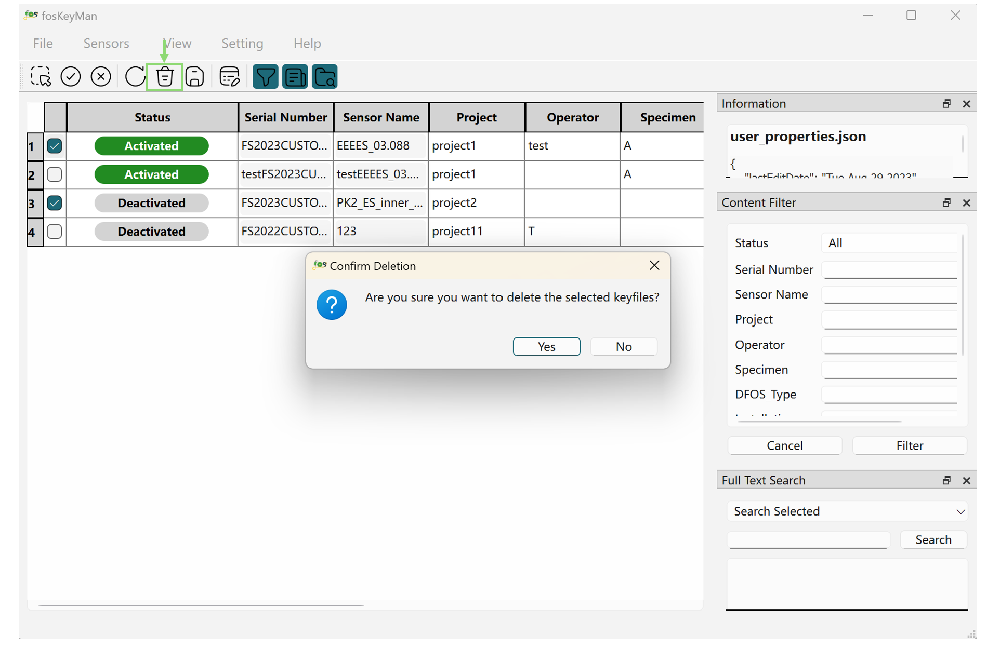
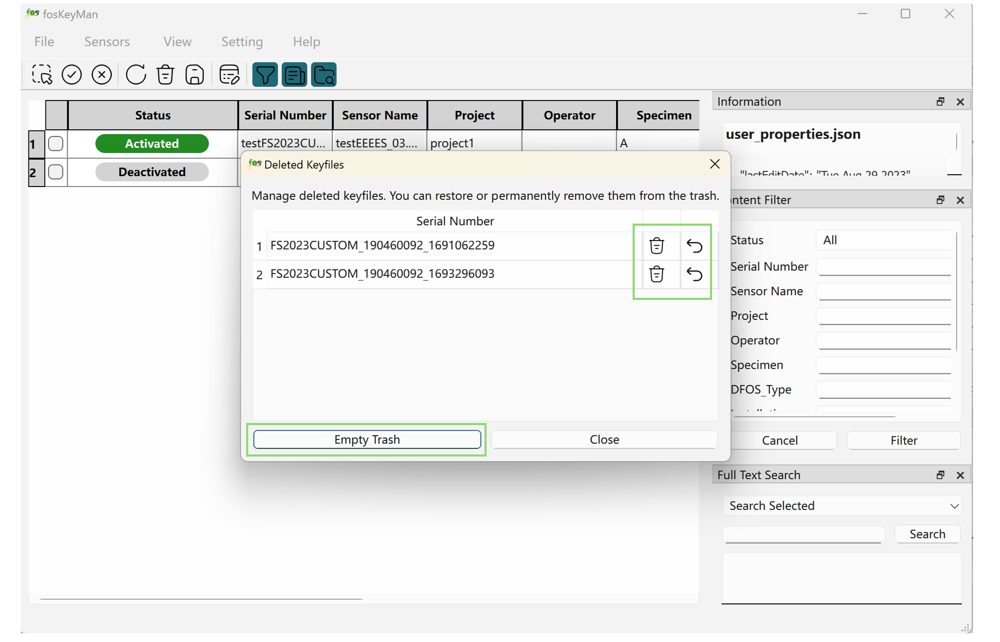
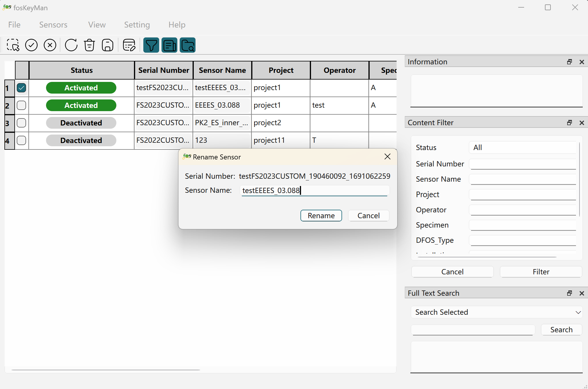
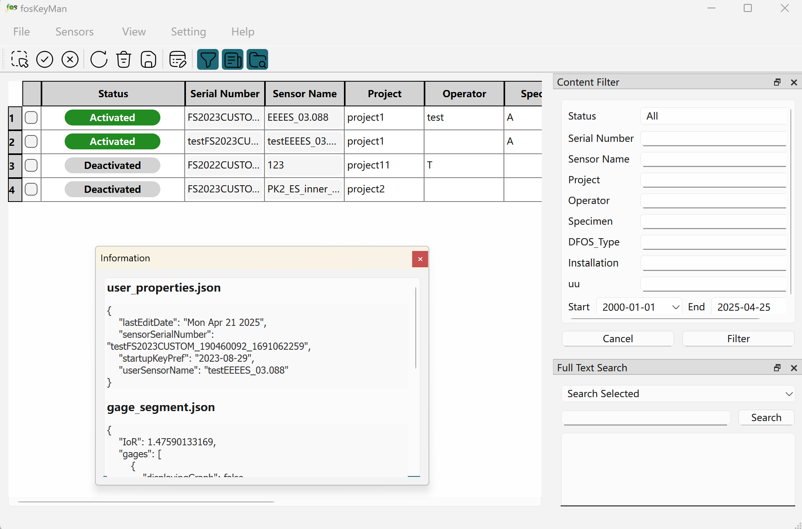

# fosKeyMan – Fiber Optic Sensor Key Manager for Luna ODiSI

[Latest automatically generated documentation](https://tud-imb.github.io/fosKeyMan/)

This documentation is available in: [English](./README.md) | [Deutsch](./doc/README_de.md)

## Motivation
Each distributed fiber optic sensor (DFOS) has a unique backscattering behavior.
Since this behavior is unique, the characteristics are called "fingerprint" of the DFOS.
The interrogator ODiSI 6100 series manufactured by Luna Inc. stores such fingerprints in so called key files.
DFOS connected to the ODiSI are identified by comparing their fingerprint to those stored ODiSI's key collection.
This process takes the more time, the more keys are active.
Hence, it is desirable to have only the keys to the connected DFOS active.
One can activate and deactivate keys in the "Manage Sensor Keys" interface of the ODiSI software,
but the presented list is difficult to navigate and does not provide meta-data.
Additionally, there is no search function, so finding the desired keys is tricky and managing sensor keys is tedious.
Hence, working with many DFOS (and thus many keys) gets cumbersome.
fosKeyMan aims to provide a more userfriendly interface for DFOS sensor key management.

## Quick Start

### Connection Setting
On first launch, a configuration dialog will appear, prompting you to select three keyfile directories.

- One directory for **activated** keys
- One directory for **deactivated** keys
- One directory for **deleted** (trash) keys

Once configured, the software will automatically load and display all available keyfiles from the activated and deactivated directories.
You can update these paths later via **Settings → Connection Settings** if needed. 
>After the initial configuration, as long as the directories remain valid and accessible, the software will continue reading keyfiles from those locations on startup.

### Activated & Deactivated Keyfiles

The keyfile table displays each key's activation status (activated or deactivated) along with related metadata.

To select keyfiles, use the checkboxes at the beginning of each table row.
Once selected, you can quickly toggle their activation status by clicking the **Activated** or **Deactivated** buttons in the toolbar above the table.

Additionally, a **Check All** tool is provided to quickly select all keyfiles at once.

> The activation status is determined by the keyfile's directory location. Changing the status will move the keyfile to the corresponding directory.

### Metadata Edit

In addition to the activation status, the keyfile table also displays information associated with each keyfile.

In the Info column, there are two types of fields:
- Gray columns are protected (read-only) — they cannot be edited directly.
- White columns are editable — you can freely modify these values as needed.
Any changes will be saved to the corresponding `metadata.json` file.

To edit metadata, simply type directly into the editable (white) cells.
Once you're done, click the **Save** button in the top toolbar to apply and store your changes.

In addition to editing values directly within the table, you can also select a specific keyfile using the checkbox on the left and open the Metadata Editor dialog.

Within this dialog, you can perform the following actions to manage keyfile metadata:
- Add new metadata: Enter a property and value in the input fields at the bottom, then click the **Add** button to create a new key–value pair.
- Edit existing metadata: You can directly modify values in the list above.
- Delete metadata: Click the **Delete** button next to an entry to remove it.

>The Metadata Editor allows you to create additional metadata entries without being limited by the predefined table columns.
The visibility of specific metadata fields in the table can be customized using the [Customize Table Columns](#customize-table-columns) 

##  Customization

### Customize Table Columns

To control the visibility of custom metadata in the table, you can define your own columns.
These custom columns can be toggled on or off via **View → Table Column**. 
Each column determines whether its corresponding metadata field will be displayed.

In the Customize Table Columns dialog, you can perform the following actions:
- Add a new column: Enter a column name in the input field at the bottom, then click the **Add** button.
- Edit an existing column: Click on a column name in the list above to modify it directly.
- Delete a column: Click the **Delete** button next to the column to remove it.

> The filtering conditions in the Filter Tool Panel will automatically adapt based on the current table columns.
You can always use the Filter Panel to filter and view metadata displayed in the table.
For more details, see [Tool Panel](#tool-panel).

### Customize Column Order

The order of columns in the table can be changed via drag-and-drop.
You can freely rearrange custom columns to match your preferred layout.
The customized column order is automatically saved and will be restored the next time the software is launched.

Additionally, clicking on a column header will sort the table based on the values in that column, in ascending or descending order.

## Features

### Keyfile Import & Export

You can import keyfiles from external locations or export selected ones via **Sensors → Import/Export Keyfiles**.

- Import Keyfiles: Import `.od6pkg` keyfile packages from other locations into the *deactivated* directory. The files will be automatically extracted into folders during the import process.

- Export Keyfiles: Export selected keyfiles (from either the activated or deactivated directories) to a target location. The selected folders will be automatically packaged into `.od6pkg` files during the export process.

### Deleted Keyfiles Management

A **Trash** button is available in the toolbar to delete selected keyfiles (move to trash directory).
Deleted keyfiles will no longer appear in the table.

> This is a soft delete. The keyfiles can still be recovered.

To manage deleted keyfiles, go to **Sensors → Deleted Keyfiles**.

All deleted keyfiles will be listed in the dialog, where you can perform the following actions:
- Restore: Undo the deletion and move the keyfile back to the deactivated directory.
- Delete: Permanently remove the selected keyfile from the trash directory.
*(This action is irreversible)*
- Empty Trash: Permanently delete all keyfiles in the trash directory.
*(This action is irreversible)*

> This is a permanent delete. The keyfiles cannot be recovered.

### Rename Sensor

You can select a keyfile to enable editing of the protected `Sensor Name` via **Sensors → Rename Sensor**.

### Tool Panel

By default, three tool panels are provided on the right side of the interface.
You can enable or disable each panel as needed via the toolbar or through **View → Information / Filter / Search**.

- Information Panel: Display detailed metadata related to the selected table cell, extracted from the associated keyfile’s JSON file.
When you click on a cell in the table, this panel will automatically show the corresponding keyfile information.
- Content Filter Panel:  Allow filtering table content based on different column headers, with wildcard support.
- Full-Text Search Panel: Enable full-text search in a selected keyfile or across all keyfiles if none is selected.

These tool panels can be freely dragged and positioned at any side of the main interface — top, bottom, left, or right.
They can also float independently as separate panels above the main software window.

### Internationalization

The software supports both English and German languages.
You can select your preferred language via the **Settings → Language**.
Once selected, the chosen language will be remembered and automatically applied the next time the software is launched.

## Table columns
The keyfile table contains following columns by default:

| Column Name    | Data Type | Description                                                |
|:---------------|:----------|:-----------------------------------------------------------|
| Serial Number  | str       | Serial number of the sensor                                |
| Sensor Name    | str       | Human readable name of the DFOS                            |
| Project        | str       | Project in which the DFOS is used                          |
| Operator       | str       | Person responsible for the DFOS                            |
| Specimen       | str       | Name of the specimen which the DFOS is attached to         |
| DFOS Type      | str       | Type of the cable itself (coating material, diameter, etc) |
| Installation   | str       | How the DFOS is installed at/in the specimen               |
| Notes          | str       | Verbose description of the sensor and its use              |
| Last Edit Date | str       | Date of the most recent modification to the sensor file    |
| Sensor Length  | str       | Physical length of the sensor                              |
| ...            | ...       | Optionally more data (to be continued)                     |

## Software stack
- Backend/Logic: Python3
- Frontend: Qt6/PySide6

## Authors
Bertram Richter and Xiaoli Song
