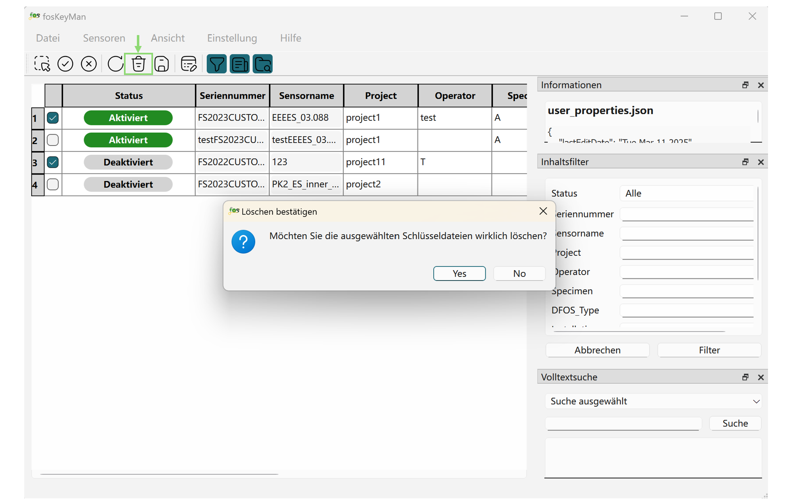

# fosKeyMan – Fiber Optic Sensor Key Manager for Luna ODiSI

[Neueste automatisch generierte Dokumentation](https://tud-imb.github.io/fosKeyMan/)

Diese Dokumentation ist verfügbar in: [English](../README.md) | [Deutsch](./README_de.md)

## Motivation

Jeder distributed fiber optic sensor (DFOS) besitzt ein einzigartiges Rückstreuverhalten. 
Da dieses Verhalten einzigartig ist, werden die charakteristischen Merkmale als „Fingerprint“ des DFOS bezeichnet.
Der Interrogator der ODiSI 6100-Serie, hergestellt von Luna Inc., speichert solche Fingerprints in sogenannten Schlüsseldateien.
DFOS, die mit dem ODiSI verbunden sind, werden identifiziert, indem ihr Fingerprint mit denen in der Schlüsseldatei-Sammlung des ODiSI verglichen wird.
Dieser Vorgang dauert umso länger, je mehr Keys gleichzeitig aktiv sind.
Daher ist es wünschenswert, nur die Keys der tatsächlich verbundenen DFOS aktiv zu halten.
Man kann Keys in der Benutzeroberfläche "Manage Sensor Keys" der ODiSI-Software aktivieren und deaktivieren,
aber die angezeigte Liste ist schwer zu durchsuchen und enthält keine Metadaten.
Außerdem gibt es keine Suchfunktion, wodurch das Auffinden bestimmter Keys schwierig ist und die Verwaltung mühsam wird.
Die Arbeit mit vielen DFOS (und entsprechend vielen Keys) wird somit schnell unübersichtlich.
fosKeyMan zielt darauf ab, eine benutzerfreundlichere Oberfläche für die Verwaltung von DFOS-Sensor-Keys bereitzustellen.

## Schnellstart

### Verbindungseinstellungen

Beim ersten Start erscheint ein Konfigurationsdialog, in dem Sie drei Verzeichnisse für die Schlüsseldateien auswählen müssen:

- Ein Verzeichnis für **aktivierte** Schlüssel  
- Ein Verzeichnis für **deaktivierte** Schlüssel  
- Ein Verzeichnis für **gelöschte** (Papierkorb) Schlüssel

Nach der Konfiguration lädt und zeigt die Software automatisch alle verfügbaren Schlüsseldateien aus den Verzeichnissen für aktivierte und deaktivierte Schlüssel an.  
Diese Pfade können später bei Bedarf unter **Einstellung → Verbindungseinstellungen** geändert werden.

> Nach der erstmaligen Konfiguration liest die Software beim Start weiterhin Schlüsseldateien aus diesen Verzeichnissen, solange diese gültig und zugänglich sind – eine erneute Einrichtung ist nicht erforderlich.

### Aktivierte & Deaktivierte Schlüsseldateien

Die Schlüsseldatei-Tabelle zeigt den Aktivierungsstatus jedes Schlüssels (aktiviert oder deaktiviert) sowie die zugehörigen Metadaten an.

Um Schlüsseldateien auszuwählen, verwenden Sie die Kontrollkästchen am Anfang jeder Tabellenzeile.  
Nach der Auswahl können Sie den Aktivierungsstatus schnell ändern, indem Sie auf die Schaltflächen **Aktiviert** oder **Deaktiviert** in der Symbolleiste über der Tabelle klicken.

Zusätzlich steht ein **Alles auswählen**-Werkzeug zur Verfügung, mit dem Sie alle Schlüsseldateien auf einmal markieren können.

> Der Aktivierungsstatus wird durch den Speicherort der Schlüsseldateien im Dateisystem bestimmt.  
> Eine Statusänderung verschiebt die jeweilige Schlüsseldatei in das entsprechende Verzeichnis.

### Metadaten bearbeiten

Zusätzlich zum Aktivierungsstatus zeigt die Schlüsseldatei-Tabelle auch Informationen an, die mit jeder Schlüsseldatei verknüpft sind.

In der Spalte Info gibt es zwei Arten von Feldern:
- Graue Spalten sind geschützt (nur lesbar) – sie können nicht direkt bearbeitet werden.  
- Weiße Spalten sind bearbeitbar – Sie können diese Werte nach Bedarf frei ändern.
Alle Änderungen werden in der zugehörigen Datei `metadata.json` gespeichert.

Um Metadaten zu bearbeiten, geben Sie die gewünschten Werte direkt in die bearbeitbaren (weißen) Zellen ein.  
Klicken Sie anschließend auf die Schaltfläche **Speichern** in der oberen Symbolleiste, um die Änderungen zu übernehmen und zu speichern.

Zusätzlich zur direkten Bearbeitung von Werten in der Tabelle können Sie eine bestimmte Schlüsseldatei über das Kontrollkästchen auf der linken Seite auswählen und den **Metadaten-Editor** öffnen.

Im Metadaten-Editor können Sie folgende Aktionen zur Verwaltung von Schlüsseldatei-Metadaten durchführen:

- Neue Metadaten hinzufügen: Geben Sie unten einen Eigenschaftsnamen und einen Wert ein und klicken Sie auf **Hinzufügen**, um ein neues Schlüssel-Wert-Paar zu erstellen.  
- Vorhandene Metadaten bearbeiten: Sie können die Werte direkt in der Liste oben ändern.  
- Metadaten löschen: Klicken Sie auf die Schaltfläche **Löschen** neben dem jeweiligen Eintrag.

> Der Metadaten-Editor ermöglicht das Hinzufügen zusätzlicher Metadaten, die nicht auf die vordefinierten Tabellenspalten beschränkt sind.  
> Die Sichtbarkeit einzelner Metadatenfelder in der Tabelle kann über die Funktion [Tabellenspalten anpassen](#customize-table-columns) konfiguriert werden.

##  Anpassung

### Tabellenspalten anpassen

Um die Sichtbarkeit benutzerdefinierter Metadaten in der Tabelle zu steuern, können Sie eigene Spalten definieren.  
Diese benutzerdefinierten Spalten können über **Ansicht → Tabellenspalten** ein- oder ausgeblendet werden.  
Jede Spalte bestimmt, ob das zugehörige Metadatenfeld angezeigt wird.

Im Dialog „Tabellenspalten anpassen“ können Sie folgende Aktionen durchführen:
- Neue Spalte hinzufügen: Geben Sie unten einen Spaltennamen in das Eingabefeld ein und klicken Sie auf die Schaltfläche **Hinzufügen**.
- Vorhandene Spalte bearbeiten: Klicken Sie auf einen Spaltennamen in der obigen Liste, um ihn direkt zu ändern.
- Spalte löschen: Klicken Sie auf die Schaltfläche **Löschen** neben der Spalte, um sie zu entfernen.

> Die Filterbedingungen im Filter-Tool-Panel passen sich automatisch an die aktuellen Tabellenspalten an.  
Sie können das Filter-Panel jederzeit verwenden, um die in der Tabelle angezeigten Metadaten zu filtern und anzuzeigen.  
Weitere Informationen finden Sie im Abschnitt [Tool Panel](#tool-panel).

### Spaltenreihenfolge anpassen

Die Reihenfolge der Spalten in der Tabelle kann per Drag-and-Drop geändert werden.  
Sie können benutzerdefinierte Spalten frei anordnen, um das Layout an Ihre Vorlieben anzupassen.  
Die angepasste Spaltenreihenfolge wird automatisch gespeichert und beim nächsten Start der Software wiederhergestellt.

Außerdem können Sie durch Klicken auf einen Spaltenkopf die Tabelle nach den Werten in dieser Spalte aufsteigend oder absteigend sortieren.

## Funktionen

### Schlüsseldatei-Import & -Export

Sie können Schlüsseldateien aus externen Quellen importieren oder ausgewählte Schlüsseldateien exportieren über **Sensoren → Schlüsseldateien importieren/exportieren**.

- Schlüsseldateien importieren: Importieren Sie `.od6pkg`-Schlüsseldatei-Pakete aus anderen Verzeichnissen in das *deaktivierte* Verzeichnis. Die Dateien werden beim Importvorgang automatisch in Ordner entpackt.

- Schlüsseldateien exportieren: Exportieren Sie ausgewählte Schlüsseldateien (aus den aktivierten oder deaktivierten Verzeichnissen) in ein Zielverzeichnis. Die ausgewählten Ordner werden beim Export automatisch zu `.od6pkg`-Dateien gepackt.

### Verwaltung gelöschter Schlüsseldateien

Eine **Papierkorb**-Schaltfläche ist in der Symbolleiste verfügbar, um ausgewählte Schlüsseldateien zu löschen (in das Papierkorb-Verzeichnis zu verschieben).  
Gelöschte Schlüsseldateien werden nicht mehr in der Tabelle angezeigt.

> Dies ist ein Soft Delete. Die Schlüsseldateien können weiterhin wiederhergestellt werden.

Um gelöschte Schlüsseldateien zu verwalten, gehen Sie zu **Sensoren → Gelöschte Schlüsseldateien**.

Alle gelöschten Schlüsseldateien werden im Dialog angezeigt, in dem Sie folgende Aktionen durchführen können:
- Wiederherstellen: Macht das Löschen rückgängig und verschiebt die Schlüsseldatei zurück in das deaktivierte Verzeichnis.
- Löschen: Entfernt die ausgewählte Schlüsseldatei dauerhaft aus dem Papierkorb-Verzeichnis.  
*(Dieser Vorgang ist unwiderruflich)*
- Papierkorb leeren: Entfernt alle Schlüsseldateien im Papierkorb dauerhaft.  
*(Dieser Vorgang ist unwiderruflich)*

> Dies ist eine endgültige Löschung. Die Schlüsseldateien können nicht wiederhergestellt werden.

### Sensor umbenennen

Sie können eine Schlüsseldatei auswählen, um den geschützten `Sensor Name` über **Sensoren → Sensor umbenennen** bearbeiten zu können.

### Tool-Panel

Standardmäßig werden auf der rechten Seite der Benutzeroberfläche drei Tool-Panels bereitgestellt.  
Sie können jedes Panel bei Bedarf über die Symbolleiste oder über **Ansicht → Information / Filter / Suche** ein- oder ausblenden.

- **Informations-Panel**: Zeigt detaillierte Metadaten zur ausgewählten Tabellenzelle an, extrahiert aus der zugehörigen JSON-Datei.  
  Wenn Sie auf eine Zelle in der Tabelle klicken, zeigt dieses Panel automatisch die entsprechenden Informationen an.
- **Inhaltsfilter-Panel**: Ermöglicht das Filtern des Tabelleninhalts anhand verschiedener Spaltenüberschriften, mit Unterstützung für Platzhalter (Wildcards).
- **Volltextsuch-Panel**: Aktiviert die Volltextsuche in einer ausgewählten Schlüsseldatei oder – falls keines ausgewählt ist – über alle Schlüsseldateien hinweg.

Diese Tool-Panels können frei gezogen und an jeder Seite der Hauptoberfläche positioniert werden – oben, unten, links oder rechts.  
Sie können auch als separate, schwebende Fenster über dem Hauptfenster der Software angezeigt werden.

### Internationalisierung

Die Software unterstützt sowohl Englisch als auch Deutsch.  
Sie können Ihre bevorzugte Sprache über **Einstellung → Sprache** auswählen.  
Die gewählte Sprache wird gespeichert und beim nächsten Start der Software automatisch angewendet.

## Tabellenspalten

Die Schlüsseldatei-Tabelle enthält standardmäßig die folgenden Spalten:

| Spaltenname                | Datentyp | Beschreibung                                               |
|:---------------------------|:---------|:-----------------------------------------------------------|
| Seriennummer               | str      | Seriennummer des Sensors                                   |
| Sensorname                 | str      | Menschlich lesbarer Name des DFOS                          |
| Project                    | str      | Projekt, in dem das DFOS verwendet wird                    |
| Operator                   | str      | Verantwortliche Person für das DFOS                        |
| Specimen                   | str      | Name des Prüfkörpers, an dem das DFOS angebracht ist       |
| DFOS-Type                  | str      | Typ des Kabels (Mantelmaterial, Durchmesser usw.)          |
| Installation               | str      | Art der Installation des DFOS am/im Prüfkörper             |
| Note                       | str      | Ausführliche Beschreibung des Sensors und seiner Anwendung |
| Letztes Bearbeitungsdatum  | str      | Datum der letzten Änderung an der Sensor-Datei             |
| Sensorlänge                | str      | Physikalische Länge des Sensors                            |
| ...                        | ...      | Optional weitere Daten (wird fortgesetzt)                  |

## Software-Stack

- Backend/Logik: Python3  
- Frontend: Qt6 / PySide6

## Autoren
Bertram Richter und Xiaoli Song
